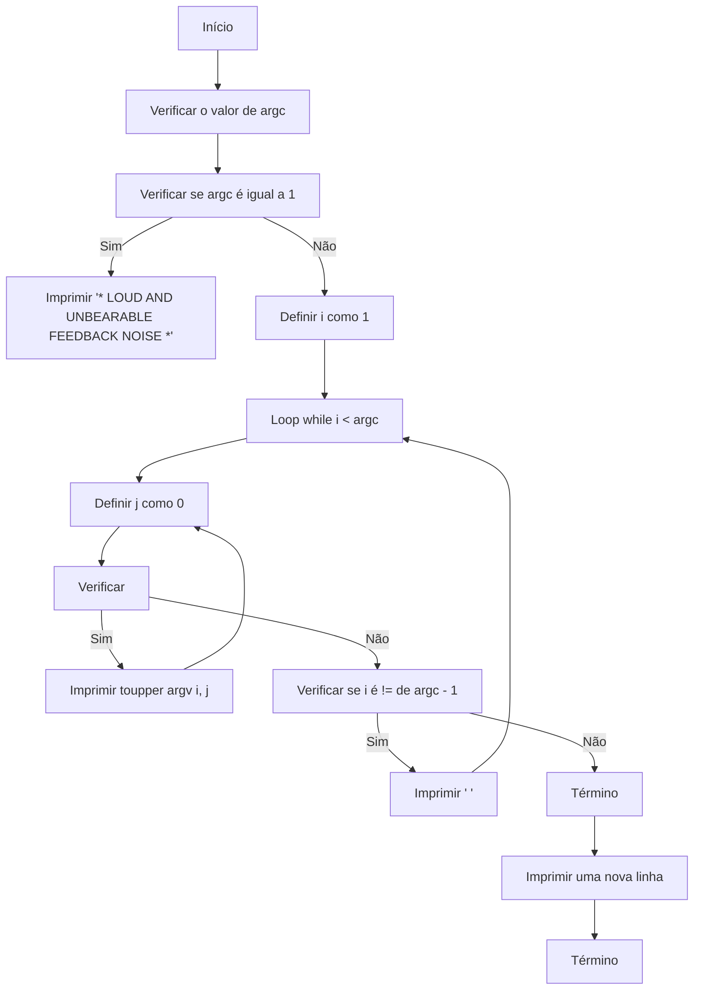

### Fluxograma

```mermaid
graph
    A[Início] --> B[Verificar o valor de argc]
    B --> C[Verificar se argc é igual a 1]
    C -- Sim --> D[Imprimir '* LOUD AND UNBEARABLE FEEDBACK NOISE *']
    C -- Não --> E[Definir i como 1]
    E --> F[Loop while i < argc]
    F --> G[Definir j como 0]
    G --> H[Verificar]
    H -- Sim --> I[Imprimir toupper argv i, j]
    H -- Não --> J[Verificar se i é != de argc - 1]
    J -- Sim --> K[Imprimir ' ']
    J -- Não --> L[Término]
    I --> G
    K --> F
    L --> M[Imprimir uma nova linha]
    M --> N[Término]
```
