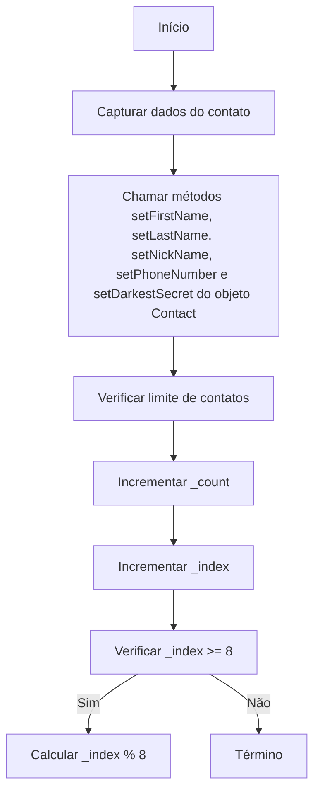
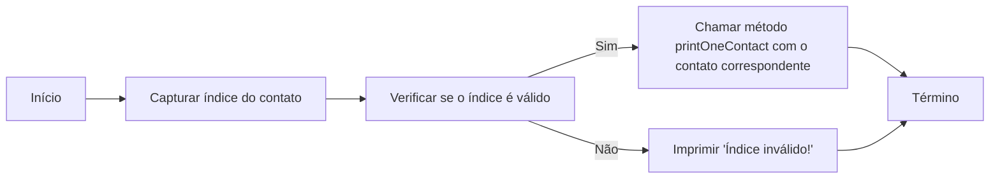
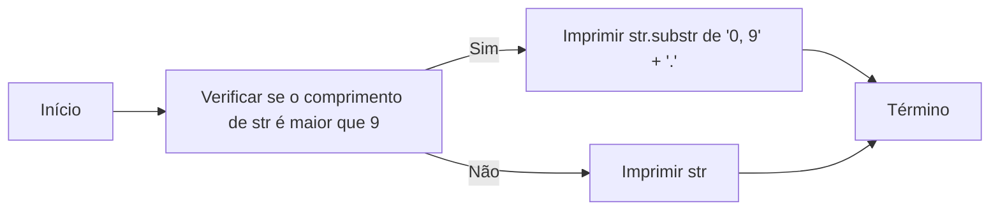
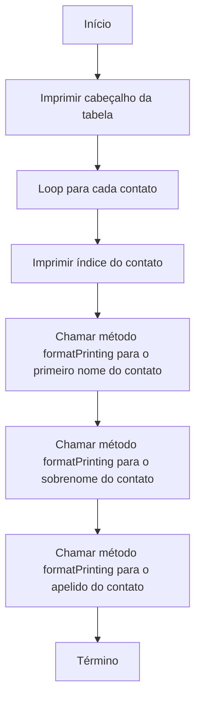
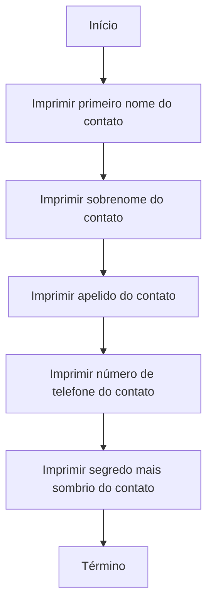

### Construtor PhoneBook::PhoneBook():

### Método PhoneBook::addContact():

### Método PhoneBook::searchContact():

### Método PhoneBook::formatPrinting():

### Método PhoneBook::printAllContacts():

### Método PhoneBook::printOneContact():

### Método PhoneBook::getContactsCount():

