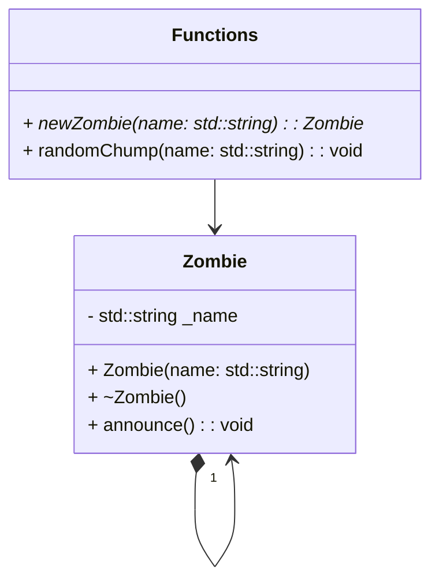
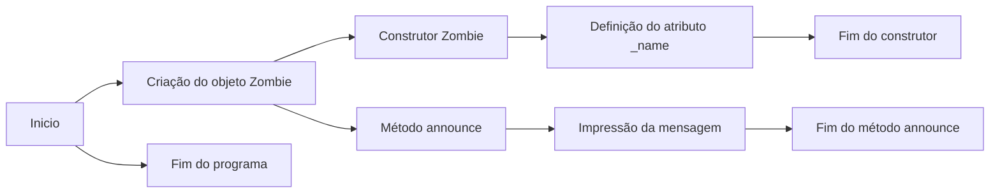
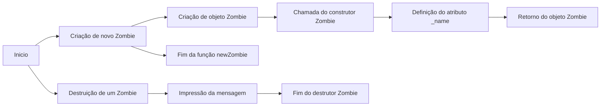
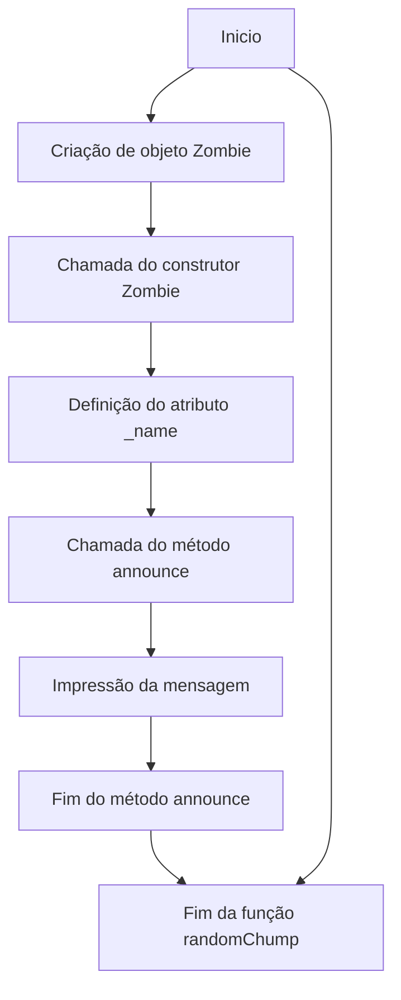

### Zombie.hpp

```mermaid
  classDiagram
    class Zombie {
        - std::string _name
        + Zombie(name: std::string)
        + ~Zombie()
        + announce(): void
    }
    Zombie *--> "1" Zombie
    class Functions {
        + newZombie(name: std::string): Zombie*
        + randomChump(name: std::string): void
    }
    Functions --> Zombie
```
### Zombie.cpp

```mermaid
graph LR
A[Inicio] --> B[Criação do objeto Zombie]
B --> C[Construtor Zombie]
C --> D[Definição do atributo _name]
D --> E[Fim do construtor]
B --> F[Método announce]
F --> G[Impressão da mensagem]
G --> H[Fim do método announce]
A --> I[Fim do programa]


```

### newZombie.cpp

```mermaid
graph LR
A[Inicio] --> B[Criação de novo Zombie]
B --> C[Criação de objeto Zombie]
C --> D[Chamada do construtor Zombie]
D --> E[Definição do atributo _name]
E --> F[Retorno do objeto Zombie]
B --> G[Fim da função newZombie]
A --> H[Destruição de um Zombie]
H --> I[Impressão da mensagem]
I --> J[Fim do destrutor Zombie]

```

### randomChump.cpp

```mermaid
graph
A[Inicio] --> B[Criação de objeto Zombie]
B --> C[Chamada do construtor Zombie]
C --> D[Definição do atributo _name]
D --> E[Chamada do método announce]
E --> F[Impressão da mensagem]
F --> G[Fim do método announce]
G --> H[Fim da função randomChump]
A --> H
```
