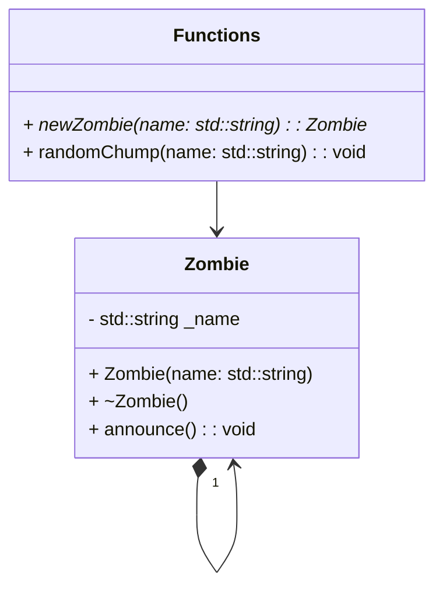

### Zombie.hpp


```mermaid
  classDiagram
    class Zombie {
        - std::string _name
        + Zombie(name: std::string)
        + ~Zombie()
        + announce(): void
    }
    Zombie *--> "1" Zombie
    class Functions {
        + newZombie(name: std::string): Zombie*
        + randomChump(name: std::string): void
    }
    Functions --> Zombie
```
### Zombie.cpp
```mermaid

```

### newZombie.cpp
```mermaid

```

### randomChump.cpp
```mermaid

```
