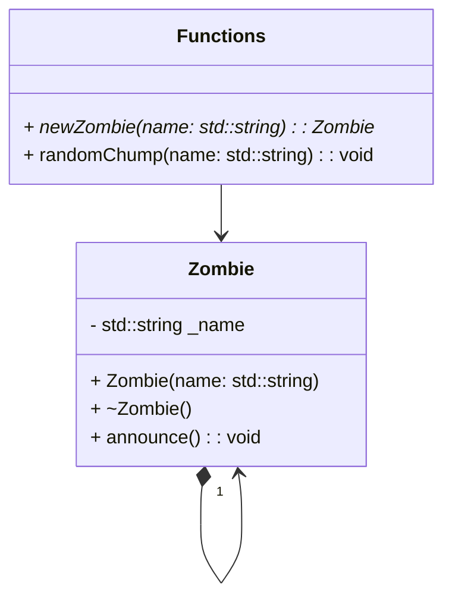
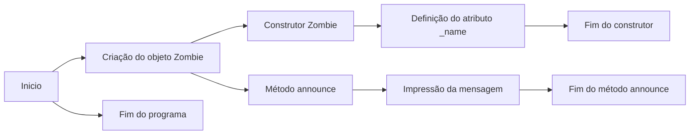
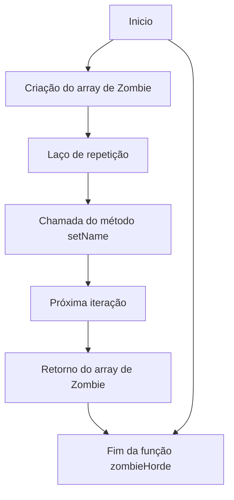

### Zombie.hpp

```mermaid
classDiagram
    class Zombie {
        - std::string _name
        + Zombie(name: std::string)
        + ~Zombie()
        + announce(): void
    }
    Zombie *--> "1" Zombie
    class Functions {
        + newZombie(name: std::string): Zombie*
        + randomChump(name: std::string): void
    }
    Functions --> Zombie
```

### Zombie.cpp

```mermaid
graph LR
A[Inicio] --> B[Criação do objeto Zombie]
B --> C[Construtor Zombie]
C --> D[Definição do atributo _name]
D --> E[Fim do construtor]
B --> F[Método announce]
F --> G[Impressão da mensagem]
G --> H[Fim do método announce]
A --> I[Fim do programa]

```

### zombieHorde.cpp

```mermaid
graph 
A[Inicio] --> B[Criação do array de Zombie]
B --> C[Laço de repetição]
C --> D[Chamada do método setName]
D --> E[Próxima iteração]
E --> F[Retorno do array de Zombie]
F --> G[Fim da função zombieHorde]
A --> G
```
