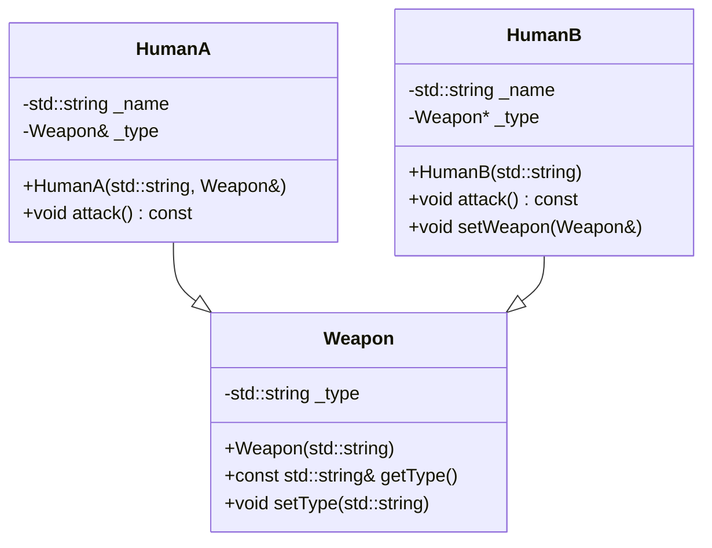
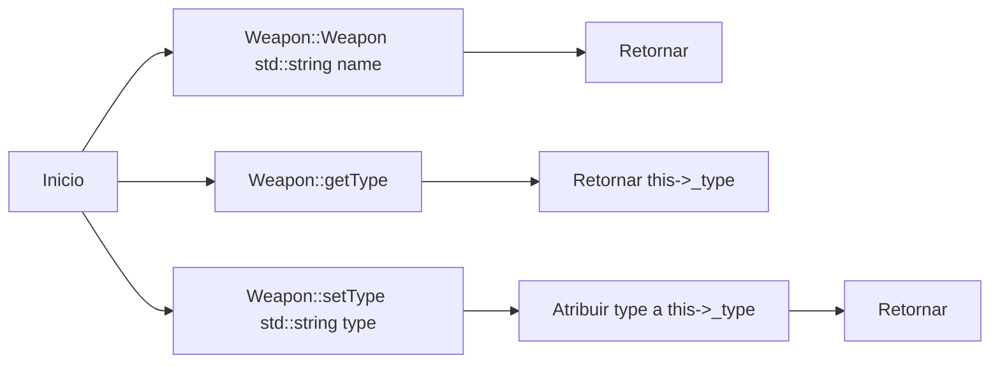
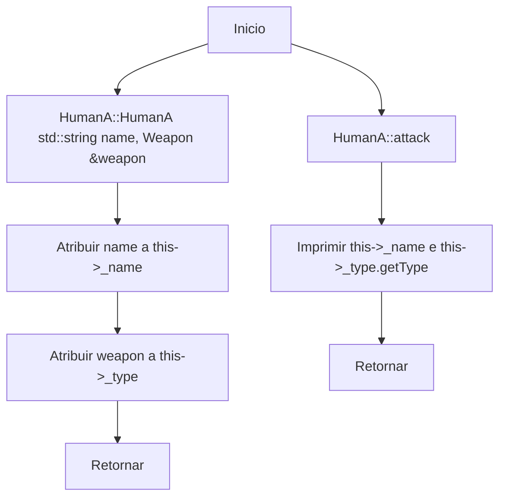
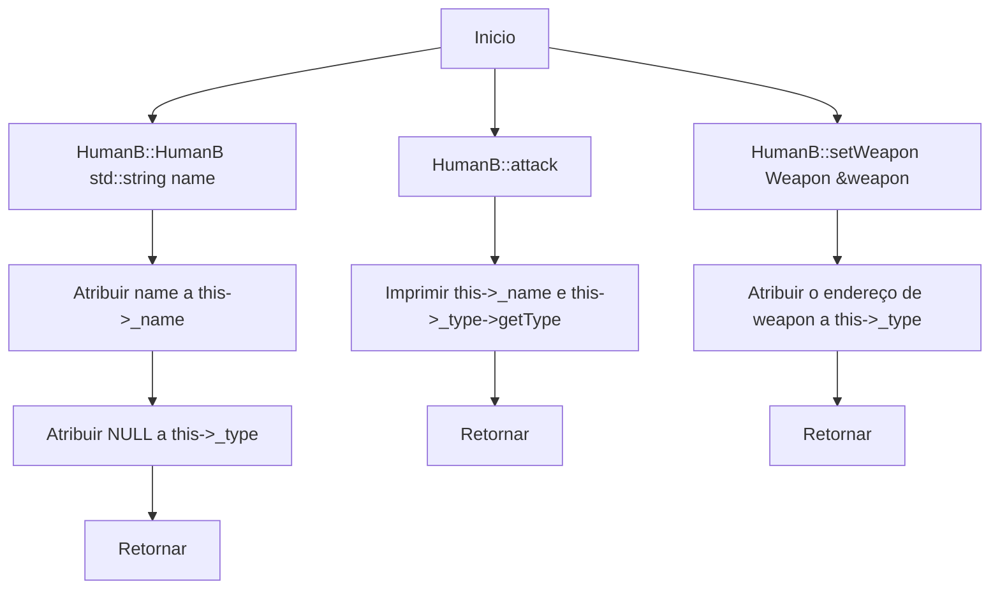

### Diagrama de Classe:

```mermaid
classDiagram
    class Weapon {
        -std::string _type
        +Weapon(std::string)
        +const std::string& getType()
        +void setType(std::string)
    }

    class HumanA {
        -std::string _name
        -Weapon& _type
        +HumanA(std::string, Weapon&)
        +void attack() const
    }

    class HumanB {
        -std::string _name
        -Weapon* _type
        +HumanB(std::string)
        +void attack() const
        +void setWeapon(Weapon&)
    }

    HumanA --|> Weapon
    HumanB --|> Weapon
```

### Weapon.cpp

```mermaid
graph LR
    A[Inicio] --> B[Weapon::Weapon std::string name]
    B --> C[Retornar]
    A --> D[Weapon::getType]
    D --> E[Retornar this->_type]
    A --> F[Weapon::setType std::string type]
    F --> G[Atribuir type a this->_type]
    G --> H[Retornar]
```

### HumanA.cpp

```mermaid
 graph
    A[Inicio] --> B[HumanA::HumanA std::string name, Weapon &weapon]
    B --> C[Atribuir name a this->_name]
    C --> D[Atribuir weapon a this->_type]
    D --> E[Retornar]
    A --> F[HumanA::attack]
    F --> G[Imprimir this->_name e this->_type.getType]
    G --> H[Retornar]
```

### HumanB.cpp

```mermaid
graph
    A[Inicio] --> B[HumanB::HumanB std::string name]
    B --> C[Atribuir name a this->_name]
    C --> D[Atribuir NULL a this->_type]
    D --> E[Retornar]
    A --> F[HumanB::attack]
    F --> G[Imprimir this->_name e this->_type->getType]
    G --> H[Retornar]
    A --> I[HumanB::setWeapon Weapon &weapon]
    I --> J[Atribuir o endereço de weapon a this->_type]
    J --> K[Retornar]
```
