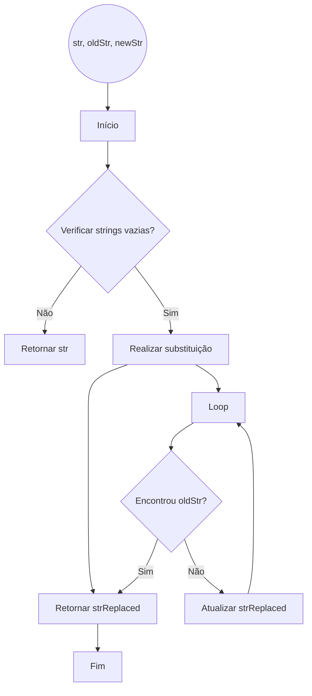

### strReplace.cpp

```mermaid
graph
    start[Início]
    input((str, oldStr, newStr)) --> start
    cond1{Verificar strings vazias?}
    start --> cond1
    cond1 -- Não --> process1[Retornar str]
    cond1 -- Sim --> process2[Realizar substituição]
    process2 --> output[Retornar strReplaced]
    process2 --> loop[Loop]
    loop --> cond2{Encontrou oldStr?}
    cond2 -- Não --> process3[Atualizar strReplaced]
    process3 --> loop
    cond2 -- Sim --> output
    output --> en[Fim]
```
