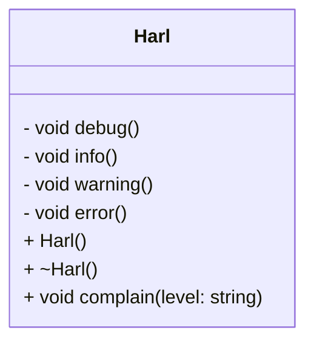
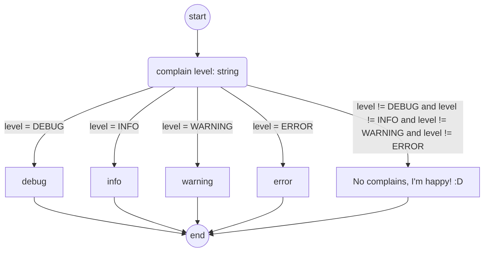

Diagrama de Classe:

```mermaid
classDiagram
    class Harl {
        - void debug()
        - void info()
        - void warning()
        - void error()
        + Harl()
        + ~Harl()
        + void complain(level: string)
    }
```

### Fluxograma:

```mermaid
flowchart
    A((start)) --> B(complain level: string)
    B --> |level = DEBUG| C[debug]
    B --> |level = INFO| D[info]
    B --> |level = WARNING| E[warning]
    B --> |level = ERROR| F[error]
    B --> |level != DEBUG and level != INFO and level != WARNING and level != ERROR| G[No complains, I'm happy! :D]
    C --> H((end))
    D --> H
    E --> H
    F --> H
    G --> H
```
