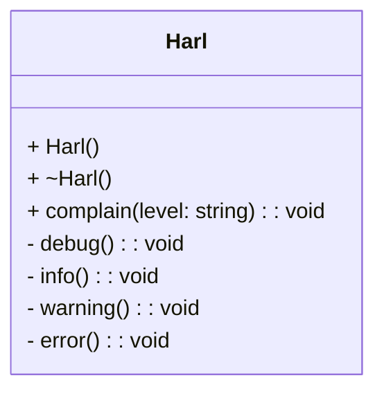
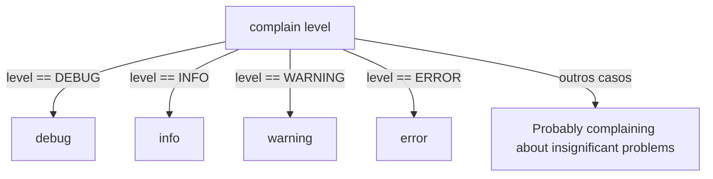

### Diagrama de Classe:

```mermaid
classDiagram
    class Harl {
        + Harl()
        + ~Harl()
        + complain(level: string): void
        - debug(): void
        - info(): void
        - warning(): void
        - error(): void
    }
```
### Fluxograma

```mermaid
graph
    A[complain level] -->|level == DEBUG| B[debug]
    A -->|level == INFO| C[info]
    A -->|level == WARNING| D[warning]
    A -->|level == ERROR| E[error]
    A -->|outros casos| F[Probably complaining about insignificant problems]
```
