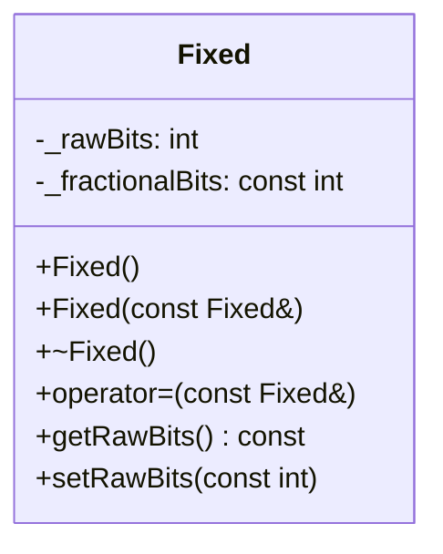
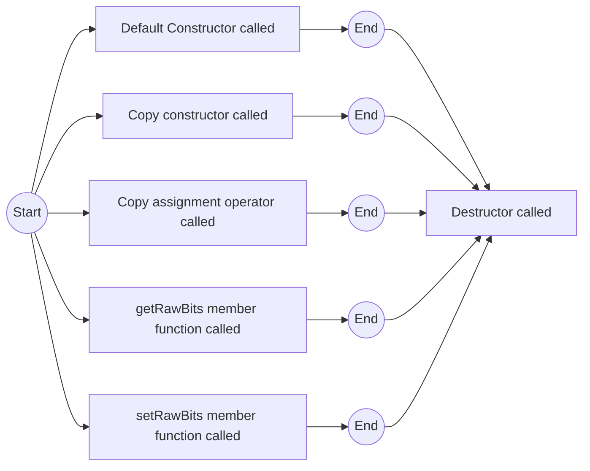

### Diagrama de Classe:

```mermaid
classDiagram
    class Fixed {
        +Fixed()
        +Fixed(const Fixed&)
        +~Fixed()
        +operator=(const Fixed&)
        +getRawBits() const
        +setRawBits(const int)
        -_rawBits: int
        -_fractionalBits: const int
    }


```

### Fluxograma:

```mermaid
graph LR
    A((Start)) --> B[Default Constructor called]
    B --> C((End))
    A --> D[Copy constructor called]
    D --> E((End))
    A --> F[Copy assignment operator called]
    F --> G((End))
    A --> H[getRawBits member function called]
    H --> I((End))
    A --> J[setRawBits member function called]
    J --> K((End))
    C --> L[Destructor called]
    E --> L
    G --> L
    I --> L
    K --> L


```
