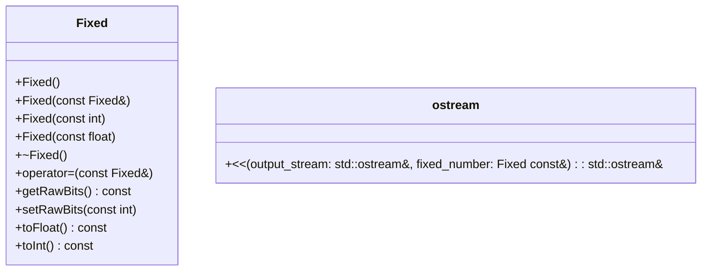

### Diagrama de Classe:


### fluxograma:
```mermaid
flowchart TD

    subgraph Fixed
        start -->|Default Constructor called| Initialize__rawBits=0
        start -->|Copy constructor called| Copy
        start -->|Destructor called| Clean
        start -->|Copy assignment operator called| Assign
        start -->|getRawBits member function called| Return
        start -->|setRawBits| Set
    end

```
