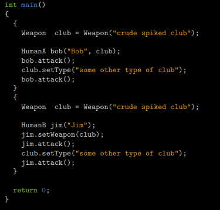

# CPP
C++ é uma linguagem de programação compilada multi-paradigma e de uso geral.O objetivo desses módulos é apresentá-lo à Programação Orientada a Objetos.
Este será o ponto de partida de sua jornada C++. Muitos idiomas são recomendados para aprender
OOP. Decidimos escolher C++, pois é derivado do seu velho amigo C.
Por se tratar de uma linguagem complexa e para manter as coisas simples, seu código estará em
conformidade com o padrão C++98

# Descrições:

- **Standard Library** - A biblioteca padrão C++ fornece vários contêineres genéricos, funções para usar e manipular esses contêineres, objetos de função, strings e fluxos genéricos (incluindo I/O interativa e de arquivo), suporte para alguns recursos de linguagem e funções para tarefas comuns, como encontrar a raiz quadrada de um número.
- **istream -** significa fluxo de entrada para obter entradas;
- **ostream -** fluxo de saída para fornecer saídas;
- **Stream(fluxo)** - É uma sequência de caracteres lidos ou gravado em um dispositivo de entrada e saída.
- **iostream** - É uma biblioteca que faz parta da biblioteca padrão “Standard Library”Composta por istream e ostream; Há 4 objetos definidos por ela:
    1. **cin** - Objeto do tipo istream usado para entrada padrão (standard input);
    2. **cout** - Significa Saída do Console. Objeto do tipo ostream de saída padrão (standard output);
    3. **cerr** - Objeto do tipo ostream de erro padrão (standard error);
    4. **clog** - Objeto do tipo ostream usado para informações gerais (general information);
- **Namespace** - É uam região declarativa que fornece uma escopo para os identificadores dentro dela. os indetificadores são:
    - Nomes de tipos, funções ou variáveis e etc. Para esses tipos de indenficadores, o namespace é uma região declarativa que fornecerá o escopo para isso.
    Namespaces são usados organizar o código em grupos lógicos e evitar colisõesdo nomes que podem ocorrer quando a base de código incluo vŕias bibliotecas.
- **Operador de resolução do escopo ::** - É utilizado para identificar e remover ambiguidades de identificadores usados em escopos diferentes. Para mais informações sobre escopo

##

<table border="1" width="300">

   <tr>
    <td  align="center"colspan="4">Listas</td>
   </tr>
  
   <tr>
      <td align="center">Exercicios </td>
      <td align="center">Descrição </td>
  </tr>
  <tr>
    <td  align="center"colspan="4">Módulo 00</td>
   </tr>
   <tr>
    <td>Ex00: Megafone</td>
    <td>Escreva um programa que se comporte da seguinte maneira: 
    $>./megaphone "shhhhh... I think the students are asleep..." 
        SHHHHH... I THINK THE STUDENTS ARE ASLEEP...  
        $>./megaphone Damnit " ! " "Sorry students, I thought this thing was off."  
        DAMNIT ! SORRY STUDENTS, I THOUGHT THIS THING WAS OFF.  
        $>./megaphone  
        * LOUD AND UNBEARABLE FEEDBACK NOISE *</td>
   </tr>

   <tr>
    <td>Ex01: Minha incrível Lista telefônica</td>
    <td>Escreva um programa que se comporte como um software de lista telefônica incrível de baixa qualidade.</td>
   </tr>
  
  <tr>
    <td>Ex02 - O emprego dos seus sonhos</td>
    <td>Seus colegas desenvolvedores fornecem vários arquivos. A compilação de tests.cpp revela que o arquivo ausente é Account.cpp. Para sua sorte, o arquivo de cabeçalho Account.hpp foi salvo. Recrie o arquivo Account.cpp</td>
   </tr>

   <tr>
    <td  align="center"colspan="4">Módulo 01</td>
   </tr>
   <tr>
    <td>Ex00: BraiiiiiiinnnzzzZ</td>
    <td>Primeiro, implemente uma classe Zombie . Ele tem um nome de atributo privado de cadeia de caracteres
    Adicione uma função de membro void anunciar( void ); para a classe Zumbi. 
	 Os zumbis se anunciam da seguinte forma: 
	 Não imprima os colchetes angulares (< e >). Para um zumbi chamado Foo, a mensagem seria: 
	 Foo: BraiiiiiiinnzzzZ...  
	 Em seguida, implemente as duas funções a seguir:  
	 • Zombie* newZombie( std::string name ); 
	 Ele cria um zumbi, nomeia e retorna para que você possa usá-lo fora da função escopo  
	 • void randomChump( std::string name ); 
	 Ele cria um zumbi, nomeia-o, e o zumbi se anuncia.  
	 Agora, qual é o objetivo real do exercício? 
	 Você tem que determinar em que caso é melhor alocar os zumbis na pilha ou heap.  
	 Os zumbis devem ser destruídos quando você não precisar mais deles. O destruidor deve imprimir uma mensagem com o nome do zumbi para 	       fins de depuração.</td>
   </tr>
   <tr>
    <td>Ex01: Moar brainz!</td>
    <td>Hora de criar uma horda de zumbis! 
    Implemente a seguinte função no arquivo apropriado:  
    Zombie* zombieHorde( int N, std::string name );  
    Ele deve alocar N objetos Zombie em uma única alocação. Em seguida, ele deve inicializar os zumbis,dando a cada um deles o nome             passado como parâmetro. A função retorna um ponteiro para o primeiro zumbi. 
    Implemente seus próprios testes para garantir que sua função zombieHorde() funcione conforme o esperado. 
    Tente chamar anuncie() para cada um dos zumbis.  
    Não se esqueça de excluir todos os zumbis e verificar se há vazamentos de memória.</td>
   </tr>
   <tr>
    <td>Ex02: HI THIS IS BRAIN</td>
    <td>Escreva um programa que contenha:  
    • Uma variável de string inicializada como "HI THIS IS BRAIN". 
    • stringPTR: Um ponteiro para a string. 
    • stringREF: Uma referência à string.  
    Seu programa deve imprimir: 
    • O endereço de memória da variável de string. 
    • O endereço de memória mantido por stringPTR. 
    • O endereço de memória mantido por stringREF  
    E então: 
    • O valor da variável de string. 
    • O valor apontado por stringPTR. 
    • O valor apontado por stringREF.  
    Isso é tudo, sem truques. O objetivo deste exercício é desmistificar referências que podem parecer completamente novas. 
    Embora existam algumas pequenas diferenças, esta é outra sintaxe para algo que você já faz: manipulação de endereço. 
   </tr>
   <tr>
    <td>Ex03: Unnecessary violence</td>
    <td>Implemente uma classe de arma que tenha: 
    • Um tipo de atributo privado, que é uma string. 
    • Uma função de membro getType() que retorna uma referência const ao tipo.
    • Uma função de membro setType() que define o tipo usando o novo passado como parâmetro  
    Agora, crie duas classes: HumanA e HumanB. Ambos têm uma arma e um nome. Eles também têm uma função de membro attack() 
    que exibe (é claro, sem os colchetes):  
    <name> attacks with their <weapon type>  
    HumanA e HumanB são quase iguais, exceto por esses dois pequenos detalhes: 
    • Enquanto HumanA pega a Arma em seu construtor, HumanB não. 
    • HumanB pode nem sempre ter uma arma, enquanto HumanA sempre estará armado. 
    Se sua implementação estiver correta, a execução do código a seguir imprimirá um ataque com "porrete cravado bruto" e um segundo 
    ataque com "algum outro tipo de clube" para ambos os casos de teste: 
     
    
   </tr>

</table>
